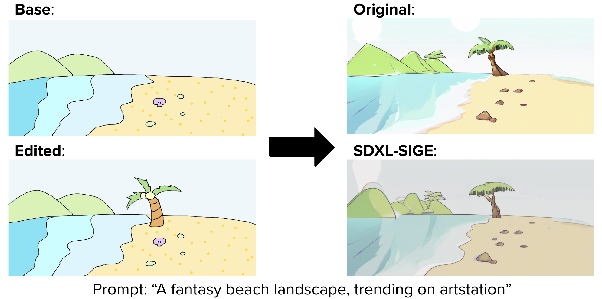

# Visual Results for SDXL

Here we are demonstrating the visual results from SDXL-SIGE. We demonstrate the performance gains and provide the code to generate these results in the section below. 

## Inpainting


## SDEdit

### Example 0


### Example 1



## SDXL Refiner


## SDXL-Turbo


# Benchmark on SDXL

## Setup

You can follow the steps below or run our code on this [](https://colab.research.google.com/drive/18f-PMC0vKkuabwpihwjEFf-87mYS_LnM?usp=sharing) notebook.

### Environment
* Install SIGE within the repo's top level directory:
  ```shell
  pip install -e .
  ```

* Install dependencies within sdxl directory:

  ```shell
  pip install torchprofile
  pip install -r requirements.txt
  ```

**Notice**: Currently SDXL's benchmark only supports CUDA with FP32 precision.

### Models

Download the model from https://github.com/CompVis/stable-diffusion. We used sdxl base 1.0 for our experiments. Put the model in `pretrained`.

```shell
mkdir -p pretrained
wget https://huggingface.co/stabilityai/stable-diffusion-xl-base-1.0/resolve/main/sd_xl_base_1.0.safetensors -O pretrained/sd_xl_base_1.0.safetensors
```

The model comes with linear attention being the default in the transformer layers. We need to convert the tensor dimension to support convolution in the transformers. It also sends fp16 weights, which need to be casted to fp32:

```
from safetensors import safe_open
from safetensors.torch import save_file
import torch

tensors = {}
with safe_open('pretrained/sd_xl_base_1.0.safetensors', framework="pt", device=0) as f:
  for k in f.keys():
        tensors[k] = f.get_tensor(k)

for k in tensors:
  tensors[k] = tensors[k].type(torch.float32)
  if 'diffusion_model' in k and ('proj_in.weight' in k or 'proj_out.weight' in k):
    a,b = tensors[k].size()
    tensors[k] = tensors[k].view(a,b,1,1)

save_file(tensors, 'pretrained/sd_xl_base_1.0.safetensors')
del tensors
```

## Get Started

### Image Inpainting

#### Quality Results 

* Original SDXL

  ```shell
  python run.py --prompt "a photograph of a horse on a grassland" \
  --output_path inpainting-original.png \
  --init_img assets/inpainting/original/0.png \
  --mask_path assets/inpainting/masks/0.npy --W 1024 --seed 53 \
  --weight_path pretrained
  ```

* SIGE SDXL

  ```shell
  python run.py --prompt "a photograph of a horse on a grassland" \
  --output_path inpainting-sige.png \
  --init_img assets/inpainting/original/0.png \
  --mask_path assets/inpainting/masks/0.npy --W 1024 --seed 53 \
  --config_path configs \
  --weight_path pretrained \
  --run_type sige
  ```

The generated images `inpainting-original.png` and `inpainting-sige.png` should look very similar.

#### Efficiency Results

* Original SDXL

  ```shell
  python run.py --prompt "a photograph of a horse on a grassland" \
  --init_img assets/inpainting/original/0.png \
  --mask_path assets/inpainting/masks/0.npy --W 1024 --seed 53 \
  --mode profile_unet
  ```

* SIGE SDXL

  ```shell
  python run.py --prompt "a photograph of a horse on a grassland" \
  --init_img assets/inpainting/original/0.png \
  --mask_path assets/inpainting/masks/0.npy --W 1024 --seed 53 \
  --config_path configs \
  --mode profile_unet \
  --run_type sige
  ```

You can also profile the decoder with the argument `--mode profile_decoder`. Reference results on Google Colab's A100 GPU.

<table>
<thead>
  <tr>
    <th rowspan="2" style="text-align: center;">Method</th>
    <th colspan="2" style="text-align: center;">UNet</th>
    <th colspan="2" style="text-align: center;">Decoder</th>
  </tr>
  <tr>
    <th style="text-align: center;">MACs (G)</th>
    <th style="text-align: center;">Latency (ms)</th>
    <th style="text-align: center;">MACs (G)</th>
    <th style="text-align: center;">Latency (ms)</th>
  </tr>
</thead>
<tbody>
  <tr>
    <td style="text-align: center;">Original</td>
    <td style="text-align: center;">3015.82</td>
    <td style="text-align: center;">319.99</td>
    <td style="text-align: center;">2481.99</td>
    <td style="text-align: center;">113.89</td>
  </tr>
  <tr>
    <td style="text-align: center;">SIGE</td>
    <td style="text-align: center;">974.42</td>
    <td style="text-align: center;">130.08</td>
    <td style="text-align: center;">343.51</td>
    <td style="text-align: center;">27.16</td>
  </tr>
</tbody>
</table>

### Image-to-image translation

#### Quality Results

* Original SDXL

  ```shell
  # Example 0
  python run.py --task sdedit \
  --prompt "A fantasy landscape, trending on artstation" \
  --output_path img2img-original0.png \
  --edited_img assets/img2img/edited/0.png --seed 11
  
  # Example 1
  python run.py --task sdedit \
  --prompt "A fantasy beach landscape, trending on artstation" \
  --output_path img2img-original1.png \
  --edited_img assets/img2img/edited/1.png --seed 95
  ```

* SIGE SDXL

  ```shell
  # Example 0
  python run.py --task sdedit \
  --prompt "A fantasy landscape, trending on artstation" \
  --output_path img2img-sige0.png \
  --init_img assets/img2img/original/0.png \
  --edited_img assets/img2img/edited/0.png --seed 11 \
  --config_path configs \
  --run_type sige

  # Example 1
  python run.py --task sdedit \
  --prompt "A fantasy beach landscape, trending on artstation" \
  --output_path img2img-sige1.png \
  --init_img assets/img2img/original/1.png \
  --edited_img assets/img2img/edited/1.png --seed 95 \
  --config_path configs \
  --run_type sige
  ```

The generated images of each example should look very similar.

#### Efficiency Results

* Original SDXL

  ```shell
  # Example 0
  python run.py --task sdedit \
  --prompt "A fantasy landscape, trending on artstation" \
  --edited_img assets/img2img/edited/0.png --seed 11 --mode profile_unet
  
  # Example 1
  python run.py --task sdedit \
  --prompt "A fantasy beach landscape, trending on artstation" \
  --edited_img assets/img2img/edited/1.png --seed 95 --mode profile_unet
  ```

* SIGE SDXL

  ```shell
  # Example 0
  python run.py --task sdedit \
  --prompt "A fantasy landscape, trending on artstation" \
  --init_img assets/img2img/original/0.png \
  --edited_img assets/img2img/edited/0.png --seed 11 \
  --config_path configs --mode profile_unet \
  --run_type sige

  # Example 1
  python run.py --task sdedit \
  --prompt "A fantasy beach landscape, trending on artstation" \
  --init_img assets/img2img/original/1.png \
  --edited_img assets/img2img/edited/1.png --seed 95 \
  --config_path configs --mode profile_unet \
  --run_type sige
  ```

You can also profile the encoder with the argument `--mode profile_encoder` and decoder with `--mode profile_decoder`. Reference results on Google Colab's A100 GPU.

<table>
<thead>
  <tr>
    <th rowspan="2" style="text-align: center;">Method</th>
    <th rowspan="2" style="text-align: center;">Example</th>
    <th colspan="2" style="text-align: center;">UNet</th>
    <th colspan="2" style="text-align: center;">Encoder</th>
    <th colspan="2" style="text-align: center;">Decoder</th>
  </tr>
  <tr>
    <th style="text-align: center;">MACs (G)</th>
    <th style="text-align: center;">Latency (ms)</th>
    <th style="text-align: center;">MACs (G)</th>
    <th style="text-align: center;">Latency (ms)</th>
    <th style="text-align: center;">MACs (G)</th>
    <th style="text-align: center;">Latency (ms)</th>
  </tr>
</thead>
<tbody>
  <tr>
    <td style="text-align: center;">Original</td>
    <td style="text-align: center;">--</td>
    <td style="text-align: center;">3015.82</td>
    <td style="text-align: center;">320.77</td>
    <td style="text-align: center;">1083.27</td>
    <td style="text-align: center;">62.53</td>
    <td style="text-align: center;">2481.99</td>
    <td style="text-align: center;">114.06</td>
  </tr>
  <tr>
    <td rowspan="2" style="text-align: center;">SIGE</td>
    <td style="text-align: center;">0</td>
    <td style="text-align: center;">592.03</td>
    <td style="text-align: center;">112.15</td>
    <td style="text-align: center;">39.18</td>
    <td style="text-align: center;">6.17</td>
    <td style="text-align: center;">154.22</td>
    <td style="text-align: center;">19.09</td>
  </tr>
  <tr>
    <td style="text-align: center;">1</td>
    <td style="text-align: center;">876.87</td>
    <td style="text-align: center;">125.16</td>
    <td style="text-align: center;">76.29</td>
    <td style="text-align: center;">8.32</td>
    <td style="text-align: center;">318.28</td>
    <td style="text-align: center;">26.13</td>
  </tr>
</tbody>
</table>

# SDXL Extensions

## Refiner

SDXL boasts a second stage pipeline known as the refiner. This model claims to refine the images to improve the results. SDXL-SIGE supports the refiner.

### Running the refiner

#### Setup

In addition to following the steps above. You need to download the refiner's model weights from https://github.com/CompVis/stable-diffusion:

```shell
mkdir -p pretrained
wget https://huggingface.co/stabilityai/stable-diffusion-xl-refiner-1.0/resolve/main/sd_xl_refiner_1.0.safetensors -O pretrained/sd_xl_refiner_1.0.safetensors
```

The model comes with linear attention being the default in the transformer layers. We need to convert the tensor dimension to support convolution in the transformers. As we only support fp32, we explicitly cast the tensors to ensure compatability:

```
from safetensors import safe_open
from safetensors.torch import save_file
import torch

tensors = {}
with safe_open('pretrained/sd_xl_refiner_1.0.safetensors', framework="pt", device=0) as f:
  for k in f.keys():
        tensors[k] = f.get_tensor(k)

for k in tensors:
  tensors[k] = tensors[k].type(torch.float32)
  if 'diffusion_model' in k and ('proj_in.weight' in k or 'proj_out.weight' in k):
    a,b = tensors[k].size()
    tensors[k] = tensors[k].view(a,b,1,1)

save_file(tensors, 'pretrained/sd_xl_refiner_1.0.safetensors')
del tensors
```

#### Image Inpainting

##### Quality Results

* Original SDXL

  ```shell
  python run.py --prompt "a photograph of a horse on a grassland" \
  --output_path inpainting-original.png \
  --init_img assets/inpainting/original/0.png \
  --mask_path assets/inpainting/masks/0.npy --W 1024 --seed 53 \
  --weight_path pretrained \
  --refined True
  ```

* SIGE SDXL

  ```shell
  python run.py --prompt "a photograph of a horse on a grassland" \
  --output_path inpainting-sige.png \
  --init_img assets/inpainting/original/0.png \
  --mask_path assets/inpainting/masks/0.npy --W 1024 --seed 53 \
  --config_path configs \
  --weight_path pretrained \
  --run_type sige \
  --refined True
  ```

The generated images `inpainting-original.png` and `inpainting-sige.png` should look very similar.

##### Efficiency Results

* Original SDXL

  ```shell
  python run.py --prompt "a photograph of a horse on a grassland" \
  --init_img assets/inpainting/original/0.png \
  --mask_path assets/inpainting/masks/0.npy --W 1024 --seed 53 \
  --mode profile_unet \
  --refined True
  ```

* SIGE SDXL

  ```shell
  python run.py --prompt "a photograph of a horse on a grassland" \
  --init_img assets/inpainting/original/0.png \
  --mask_path assets/inpainting/masks/0.npy --W 1024 --seed 53 \
  --config_path configs \
  --mode profile_unet \
  --run_type sige \
  --refined True
  ```

Reference results on Google Colab's A100 GPU.

<table>
<thead>
  <tr>
    <th rowspan="2" style="text-align: center;">Method</th>
    <th colspan="2" style="text-align: center;">UNet</th>
  </tr>
  <tr>
    <th style="text-align: center;">MACs (G)</th>
    <th style="text-align: center;">Latency (ms)</th>
  </tr>
</thead>
<tbody>
  <tr>
    <td style="text-align: center;">Original</td>
    <td style="text-align: center;">3058.80</td>
    <td style="text-align: center;">304.85</td>
  </tr>
  <tr>
    <td style="text-align: center;">SIGE</td>
    <td style="text-align: center;">985.25</td>
    <td style="text-align: center;">118.37</td>
  </tr>
</tbody>
</table>

#### Image-to-image translation

##### Quality Results

* Original SDXL

  ```shell
  # Example 0
  python run.py --task sdedit \
  --prompt "A fantasy landscape, trending on artstation" \
  --output_path img2img-original0.png \
  --edited_img assets/img2img/edited/0.png --seed 11 \
  --refined True
  
  # Example 1
  python run.py --task sdedit \
  --prompt "A fantasy beach landscape, trending on artstation" \
  --output_path img2img-original1.png \
  --edited_img assets/img2img/edited/1.png --seed 95 \
  --refined True
  ```

* SIGE SDXL

  ```shell
  # Example 0
  python run.py --task sdedit \
  --prompt "A fantasy landscape, trending on artstation" \
  --output_path img2img-sige0.png \
  --init_img assets/img2img/original/0.png \
  --edited_img assets/img2img/edited/0.png --seed 11 \
  --config_path configs \
  --run_type sige \
  --refined True

  # Example 1
  python run.py --task sdedit \
  --prompt "A fantasy beach landscape, trending on artstation" \
  --output_path img2img-sige1.png \
  --init_img assets/img2img/original/1.png \
  --edited_img assets/img2img/edited/1.png --seed 95 \
  --config_path configs \
  --run_type sige \
  --refined True
  ```

The generated images of each example should look very similar.

##### Efficiency Results

* Original SDXL

  ```shell
  # Example 0
  python run.py --task sdedit \
  --prompt "A fantasy landscape, trending on artstation" \
  --edited_img assets/img2img/edited/0.png --seed 11 --mode profile_unet \
  --refined True
  
  # Example 1
  python run.py --task sdedit \
  --prompt "A fantasy beach landscape, trending on artstation" \
  --edited_img assets/img2img/edited/1.png --seed 95 --mode profile_unet \
  --refined True
  ```

* SIGE SDXL

  ```shell
  # Example 0
  python run.py --task sdedit \
  --prompt "A fantasy landscape, trending on artstation" \
  --init_img assets/img2img/original/0.png \
  --edited_img assets/img2img/edited/0.png --seed 11 \
  --config_path configs --mode profile_unet \
  --run_type sige \
  --refined True

  # Example 1
  python run.py --task sdedit \
  --prompt "A fantasy beach landscape, trending on artstation" \
  --init_img assets/img2img/original/1.png \
  --edited_img assets/img2img/edited/1.png --seed 95 \
  --config_path configs --mode profile_unet \
  --run_type sige \
  --refined True
  ```

Reference results on Google Colab's A100 GPU.

<table>
<thead>
  <tr>
    <th rowspan="2" style="text-align: center;">Method</th>
    <th rowspan="2" style="text-align: center;">Example</th>
    <th colspan="2" style="text-align: center;">UNet</th>
  </tr>
  <tr>
    <th style="text-align: center;">MACs (G)</th>
    <th style="text-align: center;">Latency (ms)</th>
  </tr>
</thead>
<tbody>
  <tr>
    <td style="text-align: center;">Original</td>
    <td style="text-align: center;">--</td>
    <td style="text-align: center;">3058.80</td>
    <td style="text-align: center;">304.44</td>
  </tr>
  <tr>
    <td rowspan="2" style="text-align: center;">SIGE</td>
    <td style="text-align: center;">0</td>
    <td style="text-align: center;">521.47</td>
    <td style="text-align: center;">88.04</td>
  </tr>
  <tr>
    <td style="text-align: center;">1</td>
    <td style="text-align: center;">777.37</td>
    <td style="text-align: center;">108.01</td>
  </tr>
</tbody>
</table>

## SDXL-Turbo

SDXL also has a few sample diffusion model that decreases the number of iterations during diffusion known as SDXL-Turbo. SDXL-SIGE supports integration with SDXL-Turbo.

### Running SDXL-Turbo

#### Setup

In addition to following the steps above. You need to download SDXL-Turbo's model weights from https://github.com/CompVis/stable-diffusion:

```shell
mkdir -p pretrained
wget https://huggingface.co/stabilityai/sdxl-turbo/resolve/main/sd_xl_turbo_1.0.safetensors -O pretrained/sd_xl_turbo_1.0.safetensors
```

The model comes with linear attention being the default in the transformer layers. We need to convert the tensor dimension to support convolution in the transformers. As we only support fp32, we explicitly cast the tensors to ensure compatability:

```
from safetensors import safe_open
from safetensors.torch import save_file
import torch

tensors = {}
with safe_open('pretrained/sd_xl_turbo_1.0.safetensors', framework="pt", device=0) as f:
  for k in f.keys():
        tensors[k] = f.get_tensor(k)

for k in tensors:
  tensors[k] = tensors[k].type(torch.float32)
  if 'diffusion_model' in k and ('proj_in.weight' in k or 'proj_out.weight' in k):
    a,b = tensors[k].size()
    tensors[k] = tensors[k].view(a,b,1,1)

save_file(tensors, 'pretrained/sd_xl_turbo_1.0.safetensors')
del tensors
```

#### Image Inpainting

##### Quality Results

* Original SDXL

  ```shell
  python run.py --prompt "a photograph of a horse on a grassland" \
  --output_path inpainting-original.png \
  --init_img assets/inpainting/original/0.png \
  --mask_path assets/inpainting/masks/0.npy --W 1024 --seed 53 \
  --weight_path pretrained \
  --run_type turbo
  ```

* SIGE SDXL

  ```shell
  python run.py --prompt "a photograph of a horse on a grassland" \
  --output_path inpainting-sige.png \
  --init_img assets/inpainting/original/0.png \
  --mask_path assets/inpainting/masks/0.npy --W 1024 --seed 53 \
  --config_path configs \
  --weight_path pretrained \
  --run_type sige-turbo
  ```

The generated images `inpainting-original.png` and `inpainting-sige.png` should look very similar.

##### Efficiency Results

* Original SDXL

  ```shell
  python run.py --prompt "a photograph of a horse on a grassland" \
  --init_img assets/inpainting/original/0.png \
  --mask_path assets/inpainting/masks/0.npy --W 1024 --seed 53 \
  --mode profile_unet \
  --run_type turbo
  ```

* SIGE SDXL

  ```shell
  python run.py --prompt "a photograph of a horse on a grassland" \
  --init_img assets/inpainting/original/0.png \
  --mask_path assets/inpainting/masks/0.npy --W 1024 --seed 53 \
  --config_path configs \
  --mode profile_unet \
  --run_type sige-turbo
  ```

Reference results on Google Colab's A100 GPU.

<table>
<thead>
  <tr>
    <th rowspan="2" style="text-align: center;">Method</th>
    <th colspan="2" style="text-align: center;">UNet</th>
  </tr>
  <tr>
    <th style="text-align: center;">MACs (G)</th>
    <th style="text-align: center;">Latency (ms)</th>
  </tr>
</thead>
<tbody>
  <tr>
    <td style="text-align: center;">Original</td>
    <td style="text-align: center;">3015.82</td>
    <td style="text-align: center;">321.03</td>
  </tr>
  <tr>
    <td style="text-align: center;">SIGE</td>
    <td style="text-align: center;">974.42</td>
    <td style="text-align: center;">130.03</td>
  </tr>
</tbody>
</table>

#### Image-to-image translation

##### Quality Results

* Original SDXL

  ```shell
  # Example 0
  python run.py --task sdedit \
  --prompt "A fantasy landscape, trending on artstation" \
  --output_path img2img-original0.png \
  --edited_img assets/img2img/edited/0.png --seed 11 \
  --run_type turbo
  
  # Example 1
  python run.py --task sdedit \
  --prompt "A fantasy beach landscape, trending on artstation" \
  --output_path img2img-original1.png \
  --edited_img assets/img2img/edited/1.png --seed 95 \
  --run_type turbo
  ```

* SIGE SDXL

  ```shell
  # Example 0
  python run.py --task sdedit \
  --prompt "A fantasy landscape, trending on artstation" \
  --output_path img2img-sige0.png \
  --init_img assets/img2img/original/0.png \
  --edited_img assets/img2img/edited/0.png --seed 11 \
  --config_path configs \
  --run_type sige-turbo

  # Example 1
  python run.py --task sdedit \
  --prompt "A fantasy beach landscape, trending on artstation" \
  --output_path img2img-sige1.png \
  --init_img assets/img2img/original/1.png \
  --edited_img assets/img2img/edited/1.png --seed 95 \
  --config_path configs \
  --run_type sige-turbo
  ```

The generated images of each example should look very similar.

##### Efficiency Results

* Original SDXL

  ```shell
  # Example 0
  python run.py --task sdedit \
  --prompt "A fantasy landscape, trending on artstation" \
  --edited_img assets/img2img/edited/0.png --seed 11 --mode profile_unet \
  --run_type turbo
  
  # Example 1
  python run.py --task sdedit \
  --prompt "A fantasy beach landscape, trending on artstation" \
  --edited_img assets/img2img/edited/1.png --seed 95 --mode profile_unet \
  --run_type turbo
  ```

* SIGE SDXL

  ```shell
  # Example 0
  python run.py --task sdedit \
  --prompt "A fantasy landscape, trending on artstation" \
  --init_img assets/img2img/original/0.png \
  --edited_img assets/img2img/edited/0.png --seed 11 \
  --config_path configs --mode profile_unet \
  --run_type sige-turbo

  # Example 1
  python run.py --task sdedit \
  --prompt "A fantasy beach landscape, trending on artstation" \
  --init_img assets/img2img/original/1.png \
  --edited_img assets/img2img/edited/1.png --seed 95 \
  --config_path configs --mode profile_unet \
  --run_type sige-turbo
  ```

Reference results on Google Colab's A100 GPU.

<table>
<thead>
  <tr>
    <th rowspan="2" style="text-align: center;">Method</th>
    <th rowspan="2" style="text-align: center;">Example</th>
    <th colspan="2" style="text-align: center;">UNet</th>
  </tr>
  <tr>
    <th style="text-align: center;">MACs (G)</th>
    <th style="text-align: center;">Latency (ms)</th>
  </tr>
</thead>
<tbody>
  <tr>
    <td style="text-align: center;">Original</td>
    <td style="text-align: center;">--</td>
    <td style="text-align: center;">3015.82</td>
    <td style="text-align: center;">320.21</td>
  </tr>
  <tr>
    <td rowspan="2" style="text-align: center;">SIGE</td>
    <td style="text-align: center;">0</td>
    <td style="text-align: center;">592.03</td>
    <td style="text-align: center;">114.51</td>
  </tr>
  <tr>
    <td style="text-align: center;">1</td>
    <td style="text-align: center;">876.87</td>
    <td style="text-align: center;">124.76</td>
  </tr>
</tbody>
</table>